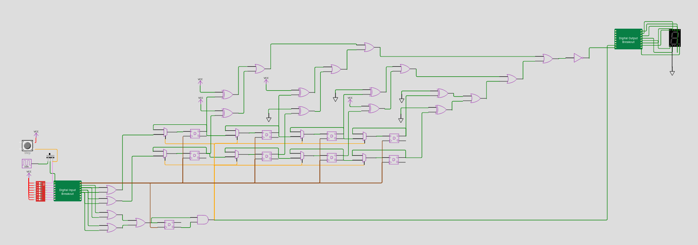

Just a simple digital logic project that fits in very few logic gates, hopefully just in time for the first TinyTapeout tapeout. Send a clock to IN0, connect four buttons (A, B, C, D) to IN1-IN4, and an LED to OUT7 (and another one to LED6 if you want additional feedback).

[Open Wokwi project](https://wokwi.com/projects/341438392303616596)

Wanna learn more about the TinyTapout project? Check their website at https://tinytapeout.com
